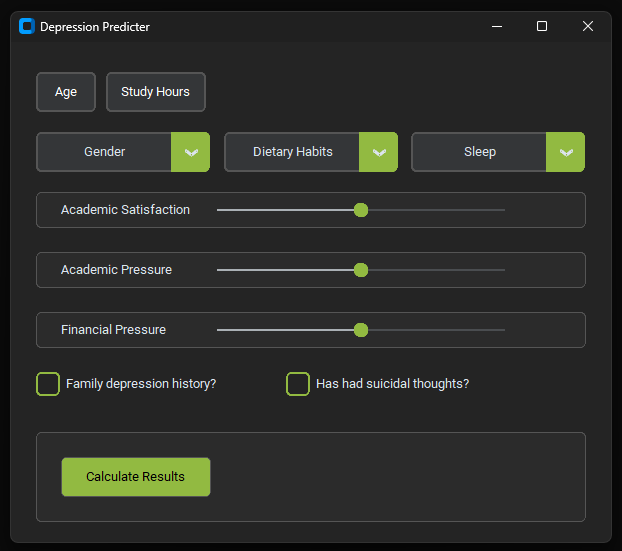
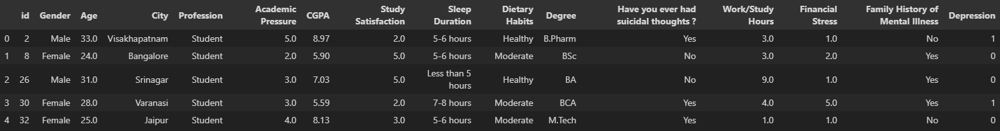

# Student Depression Risk Prediction System

A machine learning project I built to predict the risk of depression
in students based on lifestyle and academic factors like sleep, study
hours, and stress levels.

It has a desktop GUI for entering inputs and a small REST API so the
same model can be called from outside.

## Preview



## How it works

The user fills in 10 fields. The inputs are encoded and scaled, three
interaction features are added on top, and everything is passed
through a small neural network (3 fully connected layers, dropout 0.3).
The output is a probability and a risk level — low (<40%), moderate
(40-70%), or high (>=70%).

Training uses the Adam optimizer with a learning-rate scheduler and
early stopping on the training loss.

Built with PyTorch, scikit-learn, customtkinter, and FastAPI.

### Inputs

| Field | Type |
|---|---|
| Gender | Male / Female |
| Age | 18-34 |
| Work / Study Hours | 0-12 |
| Academic Pressure | 1-5 |
| Financial Stress | 1-5 |
| Study Satisfaction | 1-5 |
| Sleep Duration | More than 8 hours / 7-8 hours / 5-6 hours / Less than 5 hours |
| Dietary Habits | Healthy / Moderate / Unhealthy |
| Suicidal thoughts | Yes / No |
| Family history of mental illness | Yes / No |

## Dataset

Public Student Depression Dataset from Kaggle (~28k rows).



## Results

On a 20% held-out test split:

| Metric | Neural Net | Logistic Regression (baseline) |
|---|---|---|
| Accuracy | 0.85 | 0.85 |
| F1 | 0.87 | 0.87 |
| ROC-AUC | 0.92 | 0.92 |

Honest observation: a plain logistic regression on the same features
performs about as well as the neural net here. The dataset is mostly
linearly separable, so the extra capacity of the NN doesn't help much.

## Setup

```bash
git clone https://github.com/AradhyaStuti/Machine-Learning-Based-Student-Depression-Risk-Prediction-System.git
cd Machine-Learning-Based-Student-Depression-Risk-Prediction-System

python -m venv venv
venv\Scripts\activate

pip install -r requirements.txt
```

## Run the GUI

```bash
python main.py
```

The GUI also has a "View History" button that shows the last few
predictions saved in the local SQLite DB.

## Run the API

```bash
uvicorn src.api:app --reload
```

Endpoints:

- `GET /health` — health check (also reports if the model file is on disk)
- `POST /predict` — run a prediction
- `GET /predictions` — recent predictions saved in the SQLite DB

Example request:

```bash
curl -X POST http://localhost:8000/predict \
  -H "Content-Type: application/json" \
  -d '{
    "gender": "Male",
    "age": 22,
    "study_hours": 8,
    "academic_pressure": 4,
    "financial_stress": 3,
    "study_satisfaction": 2,
    "sleep_duration": "5-6 hours",
    "dietary_habits": "Moderate Diet",
    "suicidal_thoughts": "No",
    "family_history": "No"
  }'
```

Response:

```json
{
  "probability": 72.4,
  "risk_level": "high",
  "request_id": "..."
}
```

## Run with Docker

```bash
docker compose up --build
```

This builds the image and starts the FastAPI service on
`http://localhost:8000`. The SQLite history is mounted from the host
so predictions persist across restarts. (The desktop GUI is not built
into the container — only the API.)

## Evaluate

```bash
python -m src.evaluate
```

Prints accuracy, precision, recall, F1, ROC-AUC, and a labelled
confusion matrix for the neural network, plus the logistic regression
baseline for comparison.

## Tests

```bash
pytest
```

## Project layout

```
main.py               launches the GUI
src/
  GUI.py              desktop UI (customtkinter)
  api.py              FastAPI app
  config.py           paths, dataset columns, training settings
  database.py         SQLite store for prediction history
  evaluate.py         model metrics + LR baseline
  logging_config.py   basic logging
  model_definition.py PyTorch model, training loop, and predict()
  validation.py       input validation for the GUI
tests/
model_files/          saved model, encoder, scaler
data/                 dataset
```

## Note

This is a class project for learning ML, not a medical tool. The model
is trained on a public survey dataset and the predictions are not a
diagnosis of anything. If you or someone you know is struggling, please
talk to a professional.

## Author

Aradhya Stuti — [github.com/AradhyaStuti](https://github.com/AradhyaStuti)
